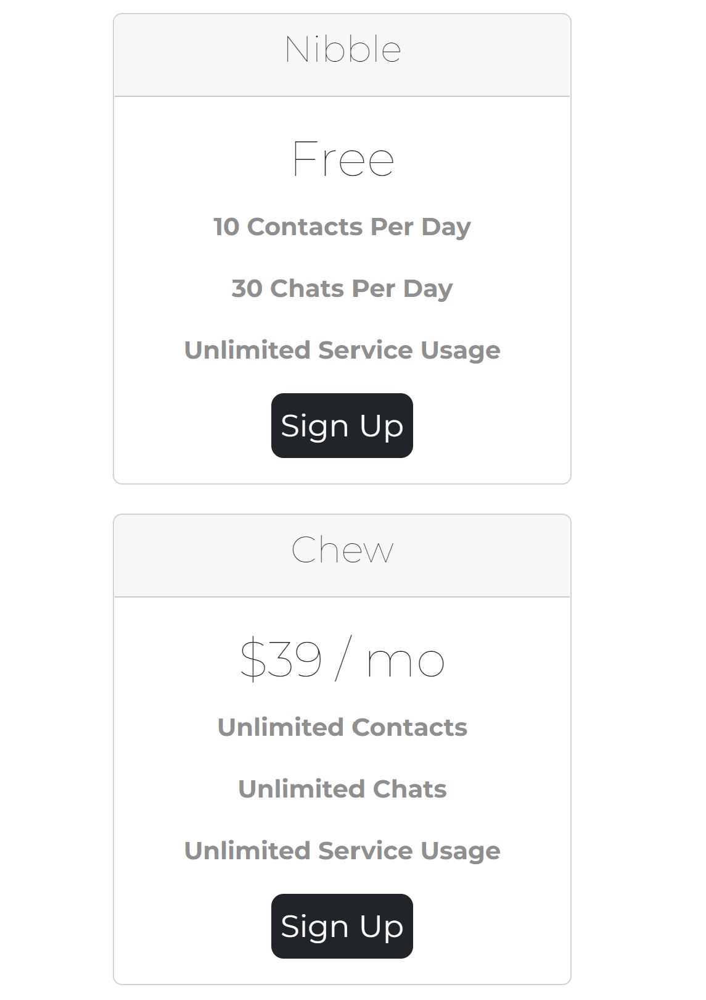

# Hamster-Leisure App 

## Description
The project lets the hamster owners find another animal lover who can look after their pet during their absence.
The project was created with bootstrap classes to achieve a responsive design to cater for mobile phone users.
&nbsp;

## Functionality
The app features a carusel class sliding across the site, showing the users' testimonials.
The class cards displays different levels of subscription ranging from a free tier to paid tiers.
&nbsp;

&nbsp;

## Mobile version

&nbsp;

